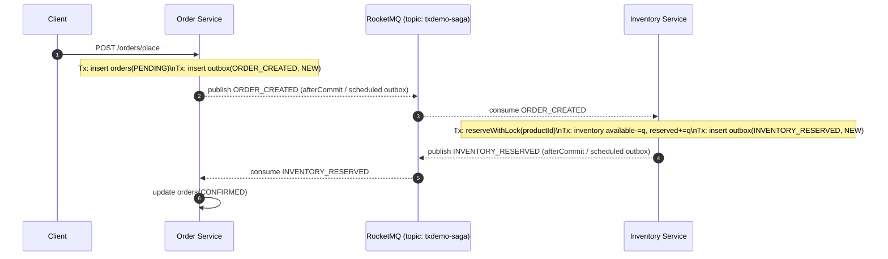
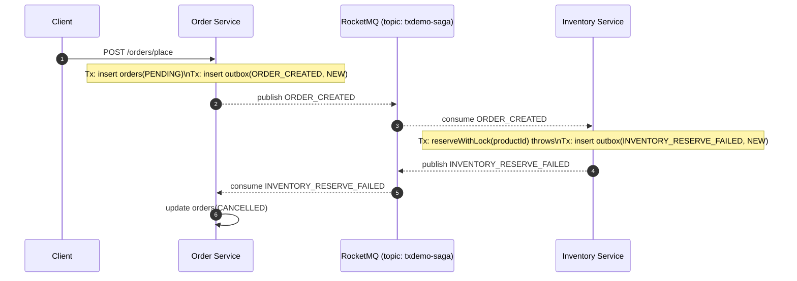

# 微服务下的分布式事务（Saga）实践 Demo

这个 Demo 通过**订单服务**和**库存服务**展示了 Saga 协调式的分布式事务，突出“**失败后补偿**”的关键思路。

## 架构思路
- **每个服务只做本地事务**：订单服务负责创建/取消订单，库存服务负责预留/释放库存。
- **Saga 协调器串联步骤**：编排执行顺序（预留库存 → 标记订单），任何一步失败即触发已完成步骤的补偿逻辑。
- **幂等 & 可补偿**：每个步骤都有对应的补偿操作，模拟真实系统中“取消订单”“释放库存”的接口。

## 链路说明（微服务版）

下面两条链路对应 `order-service/` + `inventory-service/` 这套 Spring Boot 微服务实现（MySQL + RocketMQ + Redis 分布式锁）。

### A. 正常下单链路（最终 `CONFIRMED`）

1. 客户端调用 `POST /orders/place`（订单服务）创建订单：
   - 订单服务本地事务：写 `orders`（`PENDING`）+ 写 `outbox`（`ORDER_CREATED`）
   - 事务提交后：尽快投递 outbox 到 RocketMQ（并由定时任务兜底补发）
2. 库存服务消费 `ORDER_CREATED`：
   - 幂等去重后执行本地事务：对 `productId` 加 Redis 分布式锁，预留库存（`available -= quantity`，`reserved += quantity`）
   - 写库存侧 `outbox`（`INVENTORY_RESERVED`），提交后投递 MQ（定时兜底）
3. 订单服务消费 `INVENTORY_RESERVED`：
   - 幂等去重后更新订单状态：`PENDING -> CONFIRMED`

关键代码入口：
- 下单入口：`com.example.txdemo.order.web.OrderController#place`
- 订单本地事务 + outbox：`com.example.txdemo.order.service.PlaceOrderService#place`
- 订单 outbox 投递：`com.example.txdemo.order.mq.OutboxPublisher`
- 库存消费下单事件：`com.example.txdemo.inventory.mq.OrderEventConsumer`
- 库存预留（分布式锁）：`com.example.txdemo.inventory.service.InventoryService#reserveWithLock`
- 订单消费库存结果：`com.example.txdemo.order.mq.InventoryEventConsumer`

链路图（sequence）：


### B. 补偿链路（库存预留失败 -> 订单取消，最终 `CANCELLED`）

当库存服务预留失败（库存不足、获取分布式锁失败等）时，不会强行回滚订单库（因为跨库/跨服务无法 2PC），而是走 Saga 的补偿思路：将订单状态推进到失败终态。

1. 客户端调用 `POST /orders/place` 后订单先进入 `PENDING`（同上）
2. 库存服务消费 `ORDER_CREATED` 时预留失败：
   - 写库存侧 `outbox`（`INVENTORY_RESERVE_FAILED`），提交后投递 MQ（定时兜底）
3. 订单服务消费 `INVENTORY_RESERVE_FAILED`：
   - 更新订单状态：`PENDING -> CANCELLED`

链路图（sequence）：


说明：
- 这条补偿链路的“补偿动作”是：订单侧把订单取消（落库为 `CANCELLED`）。
- 如果你们业务还要求“订单已预留成功后，用户主动取消需要释放库存”，需要新增一条 `ORDER_CANCELLED -> inventory.release(...)` 的事件链路；当前代码未实现该分支。

## 代码入口
- `com.example.distributedtx.DemoApplication`：演示成功和失败两条链路。
- `com.example.distributedtx.saga.OrderInventorySaga`：Saga 协调器，负责执行与补偿。
- `com.example.distributedtx.service.*` & `com.example.distributedtx.model.*`：模拟两个微服务的本地事务。

运行方式（需要 JDK 17+ 与 Maven）：
```bash
mvn -q exec:java -Dexec.mainClass="com.example.distributedtx.DemoApplication"
```

## 关键片段说明
### Saga 步骤定义
```java
new SagaStep("预留库存", () -> {
    if (simulateInventoryFailure) {
        throw new IllegalStateException("刻意制造的库存预留失败");
    }
    inventoryService.reserve(productId, quantity);
}, () -> inventoryService.release(productId, quantity));
```
- `action`：正向执行预留库存。
- `compensation`：失败时释放库存。

### 执行与补偿
```java
try {
    for (SagaStep step : steps) {
        step.execute();
        executed.push(step);
    }
    // 全部成功 => 提交
} catch (Exception ex) {
    while (!executed.isEmpty()) {
        executed.pop().compensate();
    }
    // 补偿完成 => 回滚
}
```

## Demo 输出解读
1. **成功案例**：预留库存、订单进入 RESERVED，Saga 提交。
2. **失败案例**：故意制造库存失败 → 触发“释放库存 + 取消订单”补偿，Saga 回滚。

通过简单的可运行代码，可以观察 Saga 模式如何在微服务场景下用补偿动作保证数据一致性。

---

# 更贴近生产的版本（MySQL + RocketMQ + Redis 分布式锁）

本仓库还提供了两个独立的 Spring Boot 工程目录（不改你现有项目结构）：
- `inventory-service/`：库存服务（端口 `8081`）
- `order-service/`：订单服务（端口 `8182`）

核心点：
- MySQL：各自写各自库（`inventory_db` / `order_db`）
- RocketMQ：事件驱动 Saga（`ORDER_CREATED` → `INVENTORY_*`）
- Outbox：避免“写库成功但消息丢失”
- Redis：对同一 `productId` 的扣减做分布式锁

## 1) 准备 MySQL

执行 `docs/mysql-init.sql` 创建库和用户（或改成你自己的账号密码，再用环境变量覆盖配置）。

## 2) 启动 RocketMQ 和 Redis（Docker）

- RocketMQ：按 `docs/rocketmq.md` 启动（NameServer `127.0.0.1:9876`）
- Redis：按 `docs/redis.md` 启动（Redis `127.0.0.1:6379`）

## 3) 启动两个服务

库存服务：
```bash
export JAVA_HOME=$(/usr/libexec/java_home -v 21)
./mvnw -f inventory-service/pom.xml spring-boot:run
```

订单服务：
```bash
export JAVA_HOME=$(/usr/libexec/java_home -v 21)
./mvnw -f order-service/pom.xml spring-boot:run
```

## 4) curl 联调

初始化库存：
```bash
curl -X POST http://localhost:8081/inventory/seed \
  -H 'Content-Type: application/json' \
  -d '{"productId":"product-1","available":5}'
```

下单（异步 Saga，先返回 `PENDING`）：
```bash
curl -X POST http://localhost:8182/orders/place \
  -H 'Content-Type: application/json' \
  -d '{"productId":"product-1","quantity":2}'
```

查询订单状态（用返回的 `orderId` 轮询，最终 `CONFIRMED` 或 `CANCELLED`）：
```bash
curl http://localhost:8182/orders/<orderId>
curl http://localhost:8081/inventory/product-1
```
